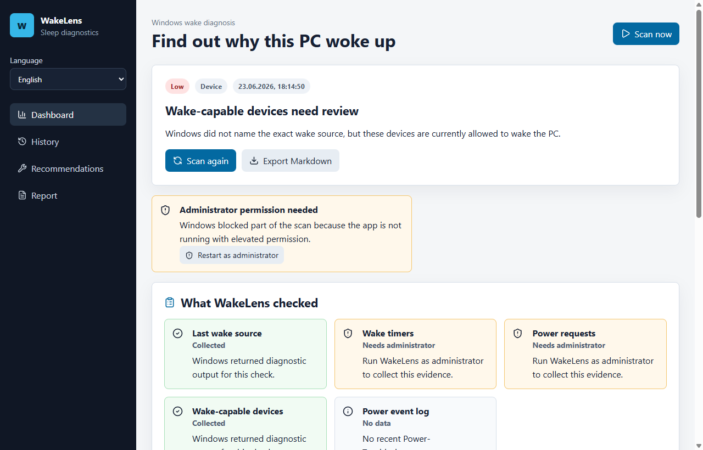

# WakeLens

WakeLens helps Windows users understand why their PC woke up from sleep.

Windows already keeps clues in `powercfg`, wake timers, wake-capable devices, power requests, and Power-Troubleshooter events. The problem is that those clues are scattered, localized, and often require administrator permission. WakeLens collects the evidence, explains what was checked, and gives safe next steps.



## Why WakeLens Exists

Unexpected wake-ups are a real Windows problem: a desktop can wake at night, a laptop can drain battery after sleep, and `Wake Source: Unknown` often gives users no practical answer. WakeLens is a readable layer over Windows diagnostics, not a replacement for them.

## What's New In 0.3.0

- Localized UI, diagnoses, recommendations, evidence cards, and Markdown reports
- Language selector with local persistence
- Arabic right-to-left layout
- Localized documentation for Simplified Chinese, Hindi, Spanish, Arabic, and Russian
- Existing scan history re-renders in the selected language

## What's New In 0.2.0

- Clear explanations for failed diagnostics, including administrator-only `powercfg` checks
- Wake-capable device analysis from `powercfg /devicequery wake_armed`
- Power-Troubleshooter event wake-source analysis
- Localized parsing improvements for Russian and English Windows output
- Redesigned dashboard with evidence cards, diagnostic issues, next steps, and technical details
- Improved history with repeated-suspect summaries
- Markdown reports now include diagnostic issues and power events
- Branded app icon and refreshed screenshots

## Languages

WakeLens 0.3.0 includes a localized app UI, diagnoses, recommendations, Markdown reports, and documentation for:

- English
- Simplified Chinese
- Hindi
- Spanish
- Modern Standard Arabic with RTL layout
- Russian

Localized documentation:

- [简体中文](docs/locales/zh-Hans/README.md)
- [हिन्दी](docs/locales/hi/README.md)
- [Español](docs/locales/es/README.md)
- [العربية](docs/locales/ar/README.md)
- [Русский](docs/locales/ru/README.md)

## Features

- One-click wake diagnosis
- Confidence level and plain-language explanation
- Evidence availability cards for each Windows check
- Local scan history with repeated suspects
- Safe recommendations that do not silently change system settings
- Markdown and JSON report export
- No telemetry

## Install

Download the latest Windows installer from [Releases](https://github.com/jeckside/wakelens/releases).

## Run From Source

```powershell
npm install
npm run dev
```

## Validate

```powershell
npm run typecheck
npm test
npm run build
```

## Build Installer

```powershell
npm run dist
```

The Windows installer is written to `release/`.

## Privacy And Safety

WakeLens stores scan history locally in the app data folder. It does not send telemetry, upload reports, or require an account.

WakeLens is diagnostic-first. It can open Windows tools such as Device Manager, Task Scheduler, power settings, or relaunch itself as administrator, but it does not silently disable devices, scheduled tasks, wake timers, or power settings.

## Documentation

- [User Guide](docs/USER_GUIDE.md)
- [Technical Notes](docs/TECHNICAL.md)
- [Troubleshooting](docs/TROUBLESHOOTING.md)
- [Release Notes](docs/RELEASE_NOTES.md)
- [Marketing](docs/MARKETING.md)

## License

MIT
