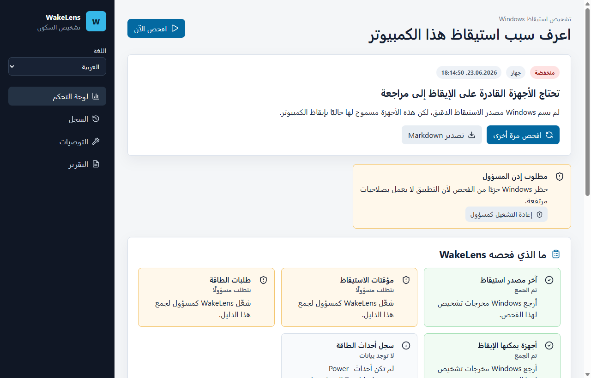

# WakeLens

يساعد WakeLens مستخدمي Windows على معرفة سبب استيقاظ الكمبيوتر من وضع السكون.

يجمع التطبيق بيانات `powercfg` ومؤقتات الاستيقاظ والأجهزة القادرة على الإيقاظ وطلبات الطاقة وأحداث Power-Troubleshooter، ثم يحولها إلى تشخيص واضح وخطوات آمنة.

## الميزات

- واجهة وتشخيصات وتقارير Markdown بالعربية؛
- اختيار لغة محفوظ محليًا؛
- شرح واضح لمشكلات صلاحيات المسؤول؛
- سجل فحوصات ومشتبهات متكررة؛
- تصدير Markdown و JSON؛
- بلا Telemetry ولا تغييرات خفية في إعدادات الطاقة.

## التثبيت

نزّل مثبت Windows من [Releases](https://github.com/jeckside/wakelens/releases).

## الوثائق

- [دليل المستخدم](USER_GUIDE.md)
- [استكشاف الأخطاء](TROUBLESHOOTING.md)
- [ملاحظات تقنية](TECHNICAL.md)
- [تسويق](MARKETING.md)
- [ملاحظات الإصدارات](RELEASE_NOTES.md)
