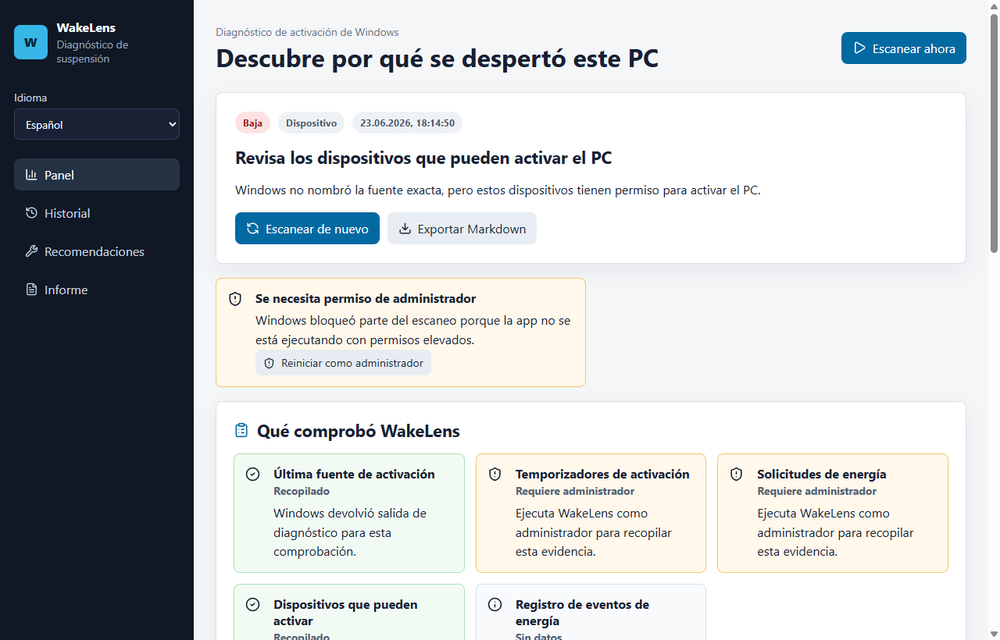

# WakeLens

WakeLens ayuda a entender por qué un equipo Windows se despertó de la suspensión.

Recopila datos de `powercfg`, temporizadores de activación, dispositivos con permiso de activación, solicitudes de energía y eventos Power-Troubleshooter. Después muestra un diagnóstico claro y pasos seguros.

## Funciones

- interfaz, diagnósticos y reportes Markdown en español;
- selector de idioma persistente;
- explicación clara de permisos de administrador;
- historial con sospechosos repetidos;
- exportación Markdown y JSON;
- sin telemetría ni cambios ocultos de configuración.

## Instalación

Descarga el instalador desde [Releases](https://github.com/jeckside/wakelens/releases).

## Documentación

- [Guía de usuario](USER_GUIDE.md)
- [Solución de problemas](TROUBLESHOOTING.md)
- [Notas técnicas](TECHNICAL.md)
- [Marketing](MARKETING.md)
- [Notas de versión](RELEASE_NOTES.md)
