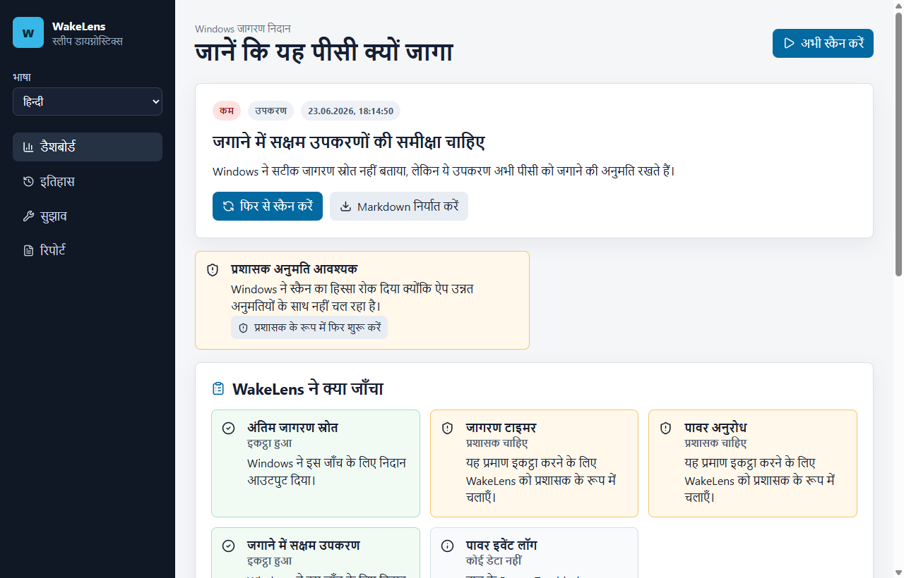

# WakeLens

WakeLens Windows उपयोगकर्ताओं को यह समझने में मदद करता है कि उनका पीसी स्लीप से क्यों जागा।

यह `powercfg`, जागरण टाइमर, जगाने में सक्षम उपकरण, पावर अनुरोध और Power-Troubleshooter इवेंट इकट्ठा करता है, फिर उन्हें साफ निदान और सुरक्षित अगले कदमों में बदलता है।

## सुविधाएँ

- हिंदी इंटरफेस, निदान और Markdown रिपोर्ट;
- चुनी हुई भाषा स्थानीय रूप से याद रहती है;
- प्रशासक अनुमति समस्याओं की साफ व्याख्या;
- स्कैन इतिहास और बार-बार दिखने वाले संदिग्ध;
- Markdown और JSON निर्यात;
- कोई telemetry नहीं और पावर सेटिंग में कोई छिपा बदलाव नहीं।

## इंस्टॉल

Windows इंस्टॉलर [Releases](https://github.com/jeckside/wakelens/releases) से डाउनलोड करें।

## दस्तावेज

- [उपयोगकर्ता गाइड](USER_GUIDE.md)
- [समस्या निवारण](TROUBLESHOOTING.md)
- [तकनीकी नोट्स](TECHNICAL.md)
- [मार्केटिंग](MARKETING.md)
- [रिलीज नोट्स](RELEASE_NOTES.md)
