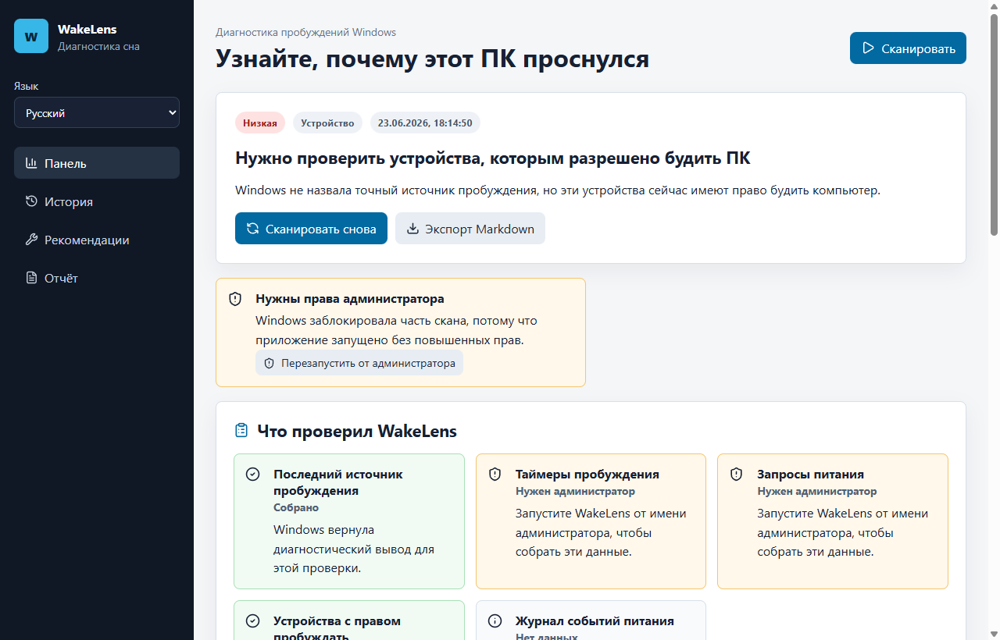

# WakeLens

WakeLens помогает понять, почему компьютер Windows проснулся из сна.

Приложение собирает данные `powercfg`, таймеры пробуждения, устройства с правом пробуждать ПК, запросы питания и события Power-Troubleshooter. Затем оно объясняет результат простым языком и показывает безопасные следующие шаги.

## Возможности

- интерфейс, диагнозы и Markdown-отчёты на русском языке;
- переключатель языка в приложении;
- понятные объяснения ошибок прав администратора;
- история сканов и повторяющиеся подозрения;
- экспорт Markdown и JSON;
- без телеметрии и без скрытого изменения настроек питания.

## Установка

Скачайте установщик из [Releases](https://github.com/jeckside/wakelens/releases).

## Документация

- [Руководство пользователя](USER_GUIDE.md)
- [Устранение неполадок](TROUBLESHOOTING.md)
- [Технические заметки](TECHNICAL.md)
- [Маркетинг](MARKETING.md)
- [Заметки к релизам](RELEASE_NOTES.md)
