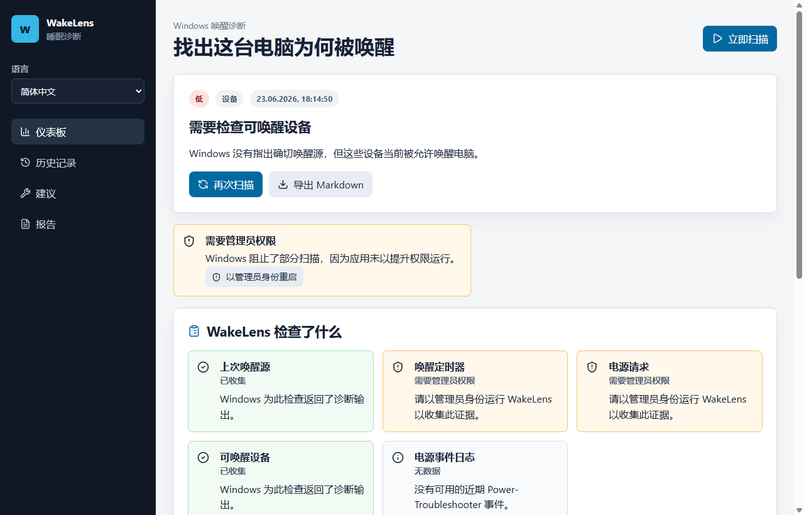

# WakeLens

WakeLens 帮助 Windows 用户了解电脑为何从睡眠中被唤醒。

它收集 `powercfg`、唤醒定时器、可唤醒设备、电源请求和 Power-Troubleshooter 事件，并把这些证据转成清晰的诊断和安全的下一步。

## 功能

- 简体中文界面、诊断和 Markdown 报告；
- 持久语言选择器；
- 清楚解释管理员权限问题；
- 扫描历史和重复嫌疑项；
- Markdown 与 JSON 导出；
- 无遥测，不会暗中修改电源设置。

## 安装

从 [Releases](https://github.com/jeckside/wakelens/releases) 下载 Windows 安装程序。

## 文档

- [用户指南](USER_GUIDE.md)
- [故障排查](TROUBLESHOOTING.md)
- [技术说明](TECHNICAL.md)
- [营销文案](MARKETING.md)
- [发行说明](RELEASE_NOTES.md)
